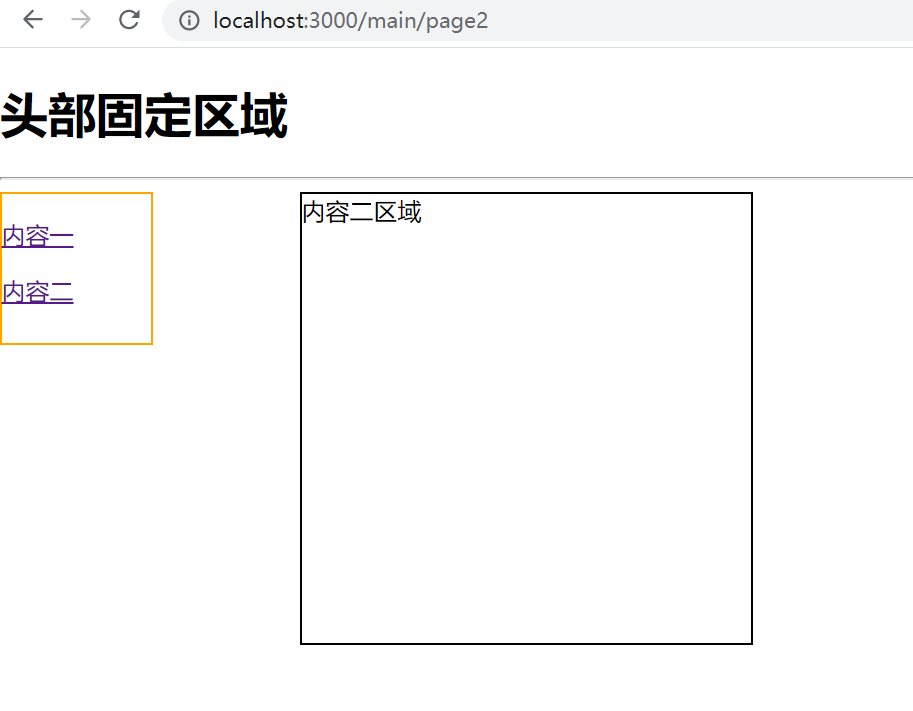

# 需求如下:

# 实现代码如下：
```js
import React, { Component } from 'react'
import {BrowserRouter,Route,Link} from 'react-router-dom'
function Top(){
  return (
    <div>
      <h1>头部固定区域</h1>
      <hr/>
      <Bottom/>
    </div>
  )
}

function BottomLeft(){
  return (
    <div style={{
      width:100,
      height:100,
      border:"1px solid orange",
      float:"left"
    }}>
      <p>
        <Link to="/main/page1">内容一</Link>
      </p>
      <p>
      <Link to="/main/page2">内容二</Link>
      </p>
    </div>
  )
}

function BottomContent1(){
  return (
    <div>
        我是内容一
    </div>
  )
}
function BottomContent2(){
  return (
    <div>
        内容二区域
    </div>
  )
}
function Bottom(){
  return (
    <div style={{
      // float:"left"
    }}>

    <BottomLeft/>

    <div style={{
      width:300,
      height:300,
      border:"1px solid black",
      marginLeft:200
    }}>
    <Route path="/main/page1" component={BottomContent1}/>
    <Route path="/main/page2" component={BottomContent2}/>
    </div>

    </div>
  )
}
export default class App extends Component {
  render() {
    return (
      <BrowserRouter>
        <Route path="/main" component={Top}/>
      </BrowserRouter>
    )
  }
}
```
**但是这种方法，父组件是什么路由跳转过来的不知道，当更改路由名称时要修改多出，很不方便，解决方案如下：**
### 方案一：使用match属性,使用模板字符串
### 方案二：使用路由配置文件
**router.config.js**
```js
// 使用方法：修改routerConfig对象
//如果使用的是main，则要写routerConfig.main.root
// 如果使用的是page1，则要写routerConfig.main.page1
// 如果使用的是page1，则要写routerConfig.main.page2.root
let routerConfig = {
    main:{
        root:"/main",
        page1:"/page1",
        page2:{
            root:"/page2",
            page2_1:"/page2-1",
            page2_2:"/page2-2"
        }
    }
}
function setRouterConfig(config){
    _setRouterConfig(config,"")
}
// 辅助函数
// 将该对象的每一个字符串属性，前面加上baseStr
// 如果属性名为root，则直接添加baseStr
// 如果属性名不是root,则添加baseStr/root
// 如果属性不是字符串，递归调用该方法
function _setRouterConfig(obj,baseStr){
    for(let prop in obj){
        const value = obj[prop];
        if(typeof value === "string"){
            if(prop === "root"){
                obj[prop] = baseStr + value
            }else{
                obj[prop] = baseStr + (obj.root === undefined ? "" : obj.root) + value;
            }
        }else{
            _setRouterConfig(obj[prop],baseStr + (obj.root === undefined ? "" : obj.root))
        }
    }
}
setRouterConfig(routerConfig);
export default routerConfig
```
**router.config.js纯代码**
```js
let routerConfig = {
    main:{
        root:"/main",
        page1:"/page1",
        page2:{
            root:"/page2",
            page2_1:"/page2-1",
            page2_2:"/page2-2"
        }
    }
}
function setRouterConfig(config){
    _setRouterConfig(config,"")
}
function _setRouterConfig(obj,baseStr){
    for(let prop in obj){
        const value = obj[prop];
        if(typeof value === "string"){
            if(prop === "root"){
                obj[prop] = baseStr + value
            }else{
                obj[prop] = baseStr + (obj.root === undefined ? "" : obj.root) + value;
            }
        }else{
            _setRouterConfig(obj[prop],baseStr + (obj.root === undefined ? "" : obj.root))
        }
    }
}
setRouterConfig(routerConfig);
export default routerConfig
```